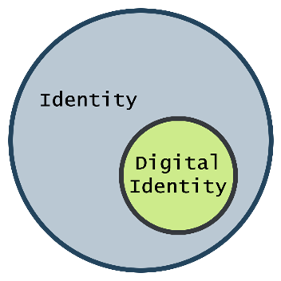
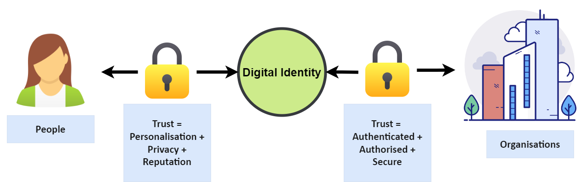

# Digital Identity Information Principles

# 1 Document Control

| _Version_ | 1.2.1                                                                                                                                                                                                                                 |
| --- |---------------------------------------------------------------------------------------------------------------------------------------------------------------------------------------------------------------------------------------|
| _Status_ | Recommended This document is a recommendation of digital identity information principles to be adopted by organisations.  The principles aim to set up a foundation for identity information based on good identity practice. |

# 2 About Digital Identity Information

## 2.1 Identity and Digital Identity

_Identity_ is a fundamental human social construct to enable trust and context between people. _Digital identity_ is a technology metaphor for human identity to allow trust in digital world.

This document takes the following convention

- In the context of the broader human social construct the term "_Identity"_ is used.
- In the context of identity in digital interactions the term "_Digital Identity_" is used.
- _Digital Identity_ is a subset of _Identity_

## 2.2 Digital Identity and Trust

The purpose of digital identity is to allow people and organisations to trust one another.

Figure 1 – The Flow of Trust in Identity

Trust in digital identity is a two-way system:

- Organisations, in exchange for streamlined digital services with broad customer reach, must trust the authenticity of the customer's digital identity in order to provide authorised and secured access to their systems.
- People, in exchange for personalised services, must trust the organisation to act as good stewards of their digital identity. As good stewards they must manage the information to prevent harm to the person's privacy and reputation.

Digital identity and customer experience are intrinsically linked. Customers place high value in the level of trust and respect in the way their identity data is treated by organisations.

# 3 Aim

Organisations that collect and mange digital identity information do so for a number of reasons that include:

- Offering online services, either to extend customer reach or it provide new channels to drive business models
- Applying security via identity management
- Profiling customers to understand their usage and habits.

Organisations must accept that the collection of digital identity information comes with the added responsibility of acting as good stewards of their customer's data. Organisations that fail to respect their obligations run the risk of damaging their trust and reputation, resulting in failure of digital service adoption.

The following principles are aimed at assisting organisations in how they manage their customer's identity information to provide a sound footing with regards to identity, privacy, and security.

# 4 Digital Identity Information Principles

| **IP-ID** | **Principle**                                                                                                                                                                                                                                                                                                                                                                                                                                                                                                                                                                                                                                                                                                                                                                                                                                                                                                                                                                                                                                                                                                                                                                                                                                                                                                      |
|-----------|--------------------------------------------------------------------------------------------------------------------------------------------------------------------------------------------------------------------------------------------------------------------------------------------------------------------------------------------------------------------------------------------------------------------------------------------------------------------------------------------------------------------------------------------------------------------------------------------------------------------------------------------------------------------------------------------------------------------------------------------------------------------------------------------------------------------------------------------------------------------------------------------------------------------------------------------------------------------------------------------------------------------------------------------------------------------------------------------------------------------------------------------------------------------------------------------------------------------------------------------------------------------------------------------------------------------|
| IP-1      | _Digital identity must be at the centre of an organisation to provide trusted customer experience._   Customers place high value in the level of trust and respect in the way their identity data is treated by organisations. Organisations that offer good experiences in their services that treat digital identity information will be trusted and therefore more preferred. To provide trust organisations must have a common and consistent source of digital identity information.                                                                                                                                                                                                                                                                                                                                                                                                                                                                                                                                                                                                                                                                                                                                                                                                                  |
| IP-2      | _Identity is unique to a person._   A customer shall have a maximum of one digital identity across all their digital interactions with an organisation. Managing multiple un-associated digital identities that relate to a single person implies an organisation does not know who their customers are.                                                                                                                                                                                                                                                                                                                                                                                                                                                                                                                                                                                                                                                                                                                                                                                                                                                                                                                                                                                                   |
| IP-3      | _Digital identity information belongs to its owner._   Digital identity information is held by an organisation under the trust that it will be respected and managed in keeping with the owner's legal entitlement to privacy. To comply with the principles in the Privacy Act the information may be only lawfully collected and used for its stated purposes.                                                                                                                                                                                                                                                                                                                                                                                                                                                                                                                                                                                                                                                                                                                                                                                                                                                                                                                                           |
| IP-4      | _Digital identity information is an asset._   Digital identity is an asset to the customer, inline with IP-3, as they are the owners of their data. As an asset it needs to align to the cultural and social expectations of the owner. In New Zealand, tikanga Māori perspectives in managing digital identity are relevant [^1].    Digital identity is an asset to the organisation who are custodians of the data. The information is valuable to the organisation as insight on who their customers are. As an asset, the customer's identity must be secured and safeguarded to mitigate risk against loss or theft by the organisation.   Digital identity information is an orthogonal domain in an organisation's infostructure. As such:   <ul><li> It should be contained in a single source of truth, and not sharded over silos or tenants.</li> <li> It should not be mixed with application specific data. Instead, application data should be separated and linked to it via a single identifier.</li> <li> Where information is required to be shared from the single source of truth to application systems (e.g., biographic or data or passwords) due to technical reasons, the reconciliation of the data must be automated to ensure accuracy and currency.</li> | 
| IP-5      | _Digital identity information is mission critical._    Identity based digital services are essential to customers. These services are subject to availability and responsiveness that is commensurate with their mission criticality.  The information: <ul><li> Must be safeguarded against loss.</li> <li> Must be accessible. </li> <li> Must not incur degraded access over time or system usage. </ul>                                                                                                                                                                                                                                                                                                                                                                                                                                                                                                                                                                                                                                                                                                                                                                                                                                                                                            |
| IP-6      | _Digital identity information is only passed to 'Justifiable Parties'._   Justifiable Parties are systems or actors that have trusted relationships with an organisation and where the customer is informed of the full nature of the data sharing arrangements of their digital identity information.                                                                                                                                                                                                                                                                                                                                                                                                                                                                                                                                                                                                                                                                                                                                                                                                                                                                                                                                                                                                     |
| IP-7      | _Minimal disclosure for constrained use._  Where digital identity information is required to be shared between system actors only the minimal amount of information is shared. This aims to constrain the proliferation of unnecessary transfer of information and thereby avoid the responsibilities that system actors then have in storing the information.                                                                                                                                                                                                                                                                                                                                                                                                                                                                                                                                                                                                                                                                                                                                                                                                                                                                                                                                             |
| IP-8      | _Customer in control._  Customers must give explicit consent for the release of their digital identity information whenever it is shared and/or provided to a service. Consent must be audited.                                                                                                                                                                                                                                                                                                                                                                                                                                                                                                                                                                                                                                                                                                                                                                                                                                                                                                                                                                                                                                                                                                            |
| IP-9      | _Identity has personas._  An identity can have many personas, but a persona belongs to a single identity.                                                                                                                                                                                                                                                                                                                                                                                                                                                                                                                                                                                                                                                                                                                                                                                                                                                                                                                                                                                                                                                                                                                                                                                                  |
| IP-10     | _Minimise the use of identifiers for digital identity._    Systems and organisations generate identifiers to manage their customers. If identifiers are shared without an intentional privacy design, then it opens up data matching techniques across information boundaries. The correlated views create damaging overreaches of the intended purposes of collection in each system.  Therefore:<ul> <li> Organisational identifiers should not be shared across organisational boundaries.</li> <li> System identifiers should not be shared across system boundaries, unless the systems are explicitly intended to be linked.</li>   </ul>                                                                                                                                                                                                                                                                                                                                                                                                                                                                                                                                                                                                                                                        |

# 5 Identity Credential Policy Principles

| **IC-ID** | **Principle**                                                                                                                                                                                                                                                                                                                                                                                                                                                          |
|-----------|------------------------------------------------------------------------------------------------------------------------------------------------------------------------------------------------------------------------------------------------------------------------------------------------------------------------------------------------------------------------------------------------------------------------------------------------------------------------|
| IC-1      | A credential is an authenticator that is possessed and/or controlled by a user that authoritatively binds the user to a registered digital identity.  Examples include username/password, pin, token, biometric, federated login (government, social etc)                                                                                                                                                                                                          |
| IC-2      | An identity may have multiple credential types as distinct credentials mapped to their digital identity.                                                                                                                                                                                                                                                                                                                                                               |
| IC-3      | A customer may only have one credential of each type.   More explicitly, this implies a customer never has to manage multiple passwords, pins, biometrics or tokens for authenticate to the organisation.  Consequently, each credential type shall have one security policy for that credential. For example, in the case of username/passwords there must be a consistent password policy irrespective of the digital service the customer is using. |

# 6 Implications

The above principles are statements that assist in building an intentional architecture that provides the best outcome for identity and customer experience.

However, there will be a need to balance these with emergent designs for initiatives that are delivering outcomes for an organisation.

The following are implications that are likely to incur identity debit as intentional architecture is balanced with emergent designs.

| **IMP-ID** | **Implication**                                                                                                                                                                                                                                                                                                                                                                                                                                                                                                                                                                                                                                                                                                                                                                                                                                                                                                          |
|------------|--------------------------------------------------------------------------------------------------------------------------------------------------------------------------------------------------------------------------------------------------------------------------------------------------------------------------------------------------------------------------------------------------------------------------------------------------------------------------------------------------------------------------------------------------------------------------------------------------------------------------------------------------------------------------------------------------------------------------------------------------------------------------------------------------------------------------------------------------------------------------------------------------------------------------|
| IMP-1      | _Data Cleansing_   Applications that maintain or reference customer identity may require data cleansing to de-duplicate records that represent multiple identities for the same customer.                                                                                                                                                                                                                                                                                                                                                                                                                                                                                                                                                                                                                                                                                                                        |
| IMP-2      | _Identity Proliferation and Reconciliation_   If identity information is copied, staged and propagated between systems then there is no single source of truth. This may result in data reconciliation processes.                                                                                                                                                                                                                                                                                                                                                                                                                                                                                                                                                                                                                                                                                                |
| IMP-3      | _Alignment of Data Models._   When these applications or services align to a common identity platform with a single view of the customer, it will also imply that their policies will also have to align. Password complexity, lifetime, reuse, controlled words are all examples. As much as possible applications or services should use identifiers to align to a common identity root (see IP-10). Applications may need to augment identity data with further application specific attributes if alignment to the common identity root is not possible. If so, this must occur in application stores and not in the common root identity store. Care should be taken not to incur debt against the problem of IMP-2.                                                                                                                                                                                         |
| IMP-4      | _Single Identity and Privacy Requests_   IP-2 makes that statement that _"a customer shall have a maximum of one identity across all their digital interactions with an organisation. Managing multiple un-associated identities that relate to a single person implies an organisation does not know who their customers are_."  While it is possible that a customer may elect to create multiple different accounts that are unlinked, it does carry privacy implications. If a customer makes a request under the privacy act to view their records held by the organisation, then all information held is the expectation. However, for customers with unlinked accounts will make the expectation difficult to meet. The best position is for the organisation to use identity verification processes to bind the customer using evidence of identity to a unique identity record in the organisation. |

# References
[1]: See https://digitalidentity.nz/2021/10/27/the-emerging-framework-of-digital-identity-in-nz/